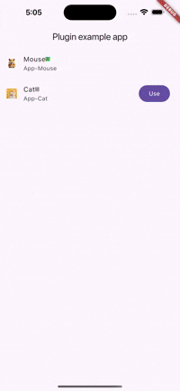
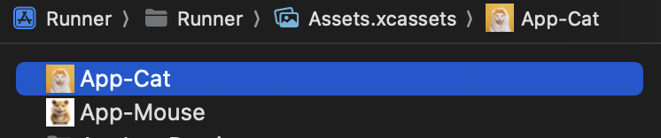
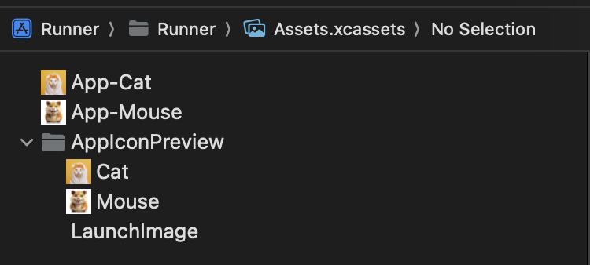
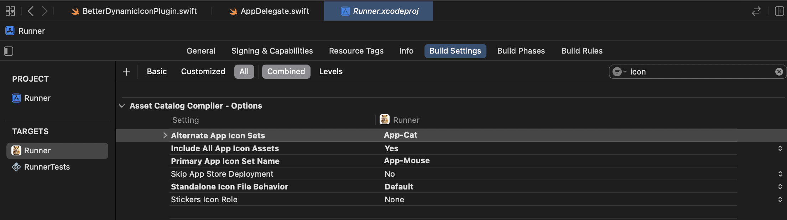

# better_dynamic_icon

Change your app icon seamlessly



## Features
1. Get list of all the available icons
2. Change icon without any hassle

## Getting Started

### Android

While developing application you might face an issue.     
Icon is changed and application compiled successfully.     
But won't launch application with new changes.    
Flutter attach can be used with existing flutter application.

To overcome this issue, change icon to default icon. Now application will run using hot-restart 
and hot-reload. 

Refer this issue https://github.com/flutter/flutter/issues/38965

In release. It will work flawlessly.
1. Provide alternate icon inside the mimap folder.
2. Provide Activity Alias

```xml 
<activity-alias    
 android:name=".cat"    
 android:icon="@mipmap/cat"    
 android:label="cat"    
 android:targetActivity=".MainActivity"    
 android:enabled="false"    
 android:exported="true">    
 <meta-data    
 android:name="io.flutter.embedding.android.NormalTheme"    
 android:resource="@style/NormalTheme"    
 />    
<intent-filter> <action android:name="android.intent.action.MAIN" />    
<category android:name="android.intent.category.LAUNCHER" />    
 </intent-filter> 
 </activity-alias> 
 ```   
Android part done.

### iOS

For iOS, you need to provide both default and alternate app icons. Follow these steps carefully:

1.  **Naming Convention**: Ensure that all app icon names start with "App-". If not, you might face issues where the application doesn't work as expected, and it can be difficult to diagnose why.  
    
2.  **Image Assets**: You need to provide two image assets for each icon. iOS has restrictions that prevent viewing alternate icons directly. To work around this, you must include  **image assets** for the same icons. This will increase the size of your app, but sometimes sacrifices are necessary to achieve the desired functionality.  
    
3.  **Build Settings**:

    - Go to the build settings of your target in Xcode.

    - Provide  **Alternate App Icon Sets**. Here, you need to list the names of all the alternate icons for your app (only the name of the  `.appiconset`, not the image assets).

    - Also, provide the  **Primary App Icon Set Name**.

    
4. At last, you need to provide image assets name inside **AppDelegate.swift**

```swift  
 IconsInitializer.icons = ["Mouse","Cat"]  
```

##### Example

```swift  
@main  
@objc class AppDelegate: FlutterAppDelegate {  
 override func application(  
 _ application: UIApplication, didFinishLaunchingWithOptions launchOptions: [UIApplication.LaunchOptionsKey: Any]?  
  ) -> Bool {  
 IconsInitializer.icons = ["Mouse","Cat"]  
 GeneratedPluginRegistrant.register(with: self)  
 return super.application(application, didFinishLaunchingWithOptions: launchOptions)  
  }  
}  
  
```  
This should help you set up dynamic app icons for both Android and iOS platforms more effectively.  
If you face any issue, you can compare you app configuration with example folder or you message me on Linkedin.

## Additional information

Connect with Author over [Linkedin](https://www.linkedin.com/in/abhishakkrmalviya/)